# 📋 MASTER IMPLEMENTATION TASK BACKLOG
### Expedient Generation 43 (`expedient-next`)
**Versi:** 1.0.0 (Production & Google Play Store Readiness)  
**Tujuan:** Panduan kerja teknis step-by-step dan komprehensif bagi developer/engineer untuk mengeksekusi hasil temuan [AUDIT.md](file:///c:/Users/LENOVO/angkatan1/expedient-next/AUDIT.md) mulai dari penambalan celah keamanan kritis (P0), penyesuaian regulasi Google Play Store, optimasi arsitektur mobile, hingga penyempurnaan UI/UX.

---

## 🗺️ Roadmap Urutan Eksekusi

```mermaid
graph TD
    subgraph P0 ["🔴 FASE 1: SECURITY & DATA INTEGRITY BLOCKERS (P0)"]
        T01["SEC-01: Fix Profiles RLS Privilege Escalation"]
        T02["SEC-02: Remove Admin Backdoor & Unify HMAC Auth"]
        T03["SEC-03: Secure Admin APIs & Fix Middleware Route Filter"]
        T04["SEC-04: Fix Baitul Maal Financial Ledger Tampering"]
        T05["SEC-05: Eliminate Ephemeral Upload & Validate MIME"]
    end

    subgraph P0_Mob ["📱 FASE 2: GOOGLE PLAY STORE COMPLIANCE & SAFETY (P0/P1)"]
        M01["MOB-01: In-App & Web Account Deletion Flow"]
        M02["MOB-02: UGC Moderation (Report & Block User)"]
        M03["MOB-03: Capacitor 6+ Native Shell & Android Configuration"]
        M04["MOB-04: Viewport 100dvh, Safe Areas & Back Button Handler"]
    end

    subgraph P1_Arch ["🟡 FASE 3: ARCHITECTURE, PERFORMANCE & STABILITY (P1)"]
        A01["ARC-01: Dynamic Code Splitting (Three.js, FaceAPI, Leaflet)"]
        A02["ARC-02: Modularize Giant Component PersonalChatClient"]
        A03["ARC-03: Fix N+1 Query & Trigram Indexing in Supabase"]
        A04["ARC-04: OTP WhatsApp Failover with Email Fallback"]
    end

    subgraph P2_UX ["🟢 FASE 4: UI/UX & ERGONOMIC ENHANCEMENTS (P2)"]
        U01["UX-01: Touch Targets Standardization (>= 44px)"]
        U02["UX-02: Progressive Disclosure on Profile Form"]
        U03["UX-03: Optimistic UI Updates on Social Interactions"]
        U04["UX-04: Progress Indicator & Error Boundary for Uploads"]
    end

    subgraph P1_QA ["🚀 FASE 5: QA TESTING & RELEASE ENGINEERING (P1)"]
        Q01["QA-01: Automated Security & RLS Regression Suite"]
        Q02["QA-02: Android Keystore Signing & Production Bundle AAB"]
    end

    P0 --> P0_Mob
    P0_Mob --> P1_Arch
    P1_Arch --> P2_UX
    P2_UX --> P1_QA
```



---

## 🔴 FASE 1: SECURITY & DATA INTEGRITY BLOCKERS (P0)

### [TASK-SEC-01] Penambalan Privilege Escalation pada RLS `public.profiles`
* **ID:** `SEC-01`
* **Prioritas:** `P0 - Blocker`
* **Area:** Database / Supabase RLS
* **File Target:**
  * [`supabase/migrations/20260907000000_fix_profiles_rls.sql`](file:///c:/Users/LENOVO/angkatan1/expedient-next/supabase/migrations/20260907000000_fix_profiles_rls.sql) (Migrasi Baru)
* **Akar Masalah:**
  Policy `Users can update own profile.` pada file [20260609000000_init_schema.sql](file:///c:/Users/LENOVO/angkatan1/expedient-next/supabase/migrations/20260609000000_init_schema.sql#L19) hanya mengecek `USING (auth.uid() = id)` tanpa klausul `WITH CHECK`. Klien authenticated dapat mengeksekusi query Supabase SDK langsung:
  `supabase.from('profiles').update({ role: 'superadmin', prestise_points: 99999 }).eq('id', user.id);`
* **Instruksi Implementasi:**
  1. Buat file migrasi SQL baru:
     ```sql
     -- Cabut policy lama
     DROP POLICY IF EXISTS "Users can update own profile." ON public.profiles;

     -- Buat policy baru dengan proteksi kolom sensitif
     CREATE POLICY "Users can update own profile non_sensitive"
     ON public.profiles
     FOR UPDATE
     USING ( auth.uid() = id )
     WITH CHECK (
         auth.uid() = id 
         AND role IS NOT DISTINCT FROM (SELECT role FROM public.profiles WHERE id = auth.uid())
         AND prestise_points IS NOT DISTINCT FROM (SELECT prestise_points FROM public.profiles WHERE id = auth.uid())
         AND is_verified IS NOT DISTINCT FROM (SELECT is_verified FROM public.profiles WHERE id = auth.uid())
     );
     ```
  2. Pastikan perubahan role dan prestise_points hanya dapat dilakukan melalui stored procedure `SECURITY DEFINER` (misal via Server Actions / Webhook) atau oleh user yang berstatus `admin`/`superadmin`.
* **Definition of Done (Acceptance Criteria):**
  - [ ] Eksekusi update kolom `role = 'superadmin'` dari client side mengembalikan error database RLS violation (HTTP 403 / Postgres code `42501`).
  - [ ] User tetap dapat memperbarui informasi non-sensitif (nama, bio, nomor telepon, alamat, avatar).

---

### [TASK-SEC-02] Eliminasi Backdoor Admin Token `"unlocked"` & Penguatan HMAC
* **ID:** `SEC-02`
* **Prioritas:** `P0 - Blocker`
* **Area:** Admin Authentication / Backend Security
* **File Target:**
  * [`src/lib/admin-auth.ts`](file:///c:/Users/LENOVO/angkatan1/expedient-next/src/lib/admin-auth.ts)
  * [`src/app/api/admin/unlock/route.ts`](file:///c:/Users/LENOVO/angkatan1/expedient-next/src/app/api/admin/unlock/route.ts)
  * [`src/app/api/admin/announcements/route.ts`](file:///c:/Users/LENOVO/angkatan1/expedient-next/src/app/api/admin/announcements/route.ts)
  * [`src/app/api/admin/broadcast/route.ts`](file:///c:/Users/LENOVO/angkatan1/expedient-next/src/app/api/admin/broadcast/route.ts)
* **Akar Masalah:**
  File [admin-auth.ts](file:///c:/Users/LENOVO/angkatan1/expedient-next/src/lib/admin-auth.ts#L12) memiliki baris kode bypass:
  ```typescript
  if (token === "unlocked") return true;
  ```
  Sementara route admin seperti `announcements/route.ts` justru mengecek string literal tersebut:
  ```typescript
  if (cookieStore.get("expedient_admin_session")?.value !== "unlocked") {
    return NextResponse.json({ error: "Unauthorized" }, { status: 401 });
  }
  ```
  Ini menyebabkan inkonsistensi fatal: token HMAC yang sah justru ditolak oleh endpoint pengumuman, sedangkan attacker yang menyuntikkan cookie `expedient_admin_session=unlocked` diterima.
* **Instruksi Implementasi:**
  1. Hapus baris `if (token === "unlocked") return true;` di [src/lib/admin-auth.ts](file:///c:/Users/LENOVO/angkatan1/expedient-next/src/lib/admin-auth.ts).
  2. Jadikan fungsi `verifyAdminSession(cookieValue)` sebagai standar tunggal untuk memvalidasi cookie admin di seluruh route handler API admin.
  3. Ganti seluruh pengecekan manual `cookieStore.get("expedient_admin_session")?.value !== "unlocked"` dengan `!(await verifyAdminSession(token))`.
  4. Hapus fallback password default `"expedient2026"` di [src/app/api/admin/unlock/route.ts](file:///c:/Users/LENOVO/angkatan1/expedient-next/src/app/api/admin/unlock/route.ts) dan wajibkan `ADMIN_MASTER_PASSWORD` berasal dari environment variable server yang aman.
* **Definition of Done (Acceptance Criteria):**
  - [ ] Cookie bernilai `"unlocked"` ditolak dengan HTTP 401 di seluruh endpoint admin.
  - [ ] Login admin melalui formulir unlock menghasilkan cookie HMAC yang valid dan dapat digunakan di semua fitur admin panel.

---

### [TASK-SEC-03] Pengamanan Route Middleware & Broken Access Control API Admin
* **ID:** `SEC-03`
* **Prioritas:** `P0 - Blocker`
* **Area:** Routing Middleware & Admin APIs
* **File Target:**
  * [`src/lib/supabase/middleware.ts`](file:///c:/Users/LENOVO/angkatan1/expedient-next/src/lib/supabase/middleware.ts)
  * [`src/app/api/admin/whatsapp/messages/route.ts`](file:///c:/Users/LENOVO/angkatan1/expedient-next/src/app/api/admin/whatsapp/messages/route.ts)
  * [`src/app/api/admin/broadcast/process/route.ts`](file:///c:/Users/LENOVO/angkatan1/expedient-next/src/app/api/admin/broadcast/process/route.ts)
  * [`src/app/api/admin/broadcast/stats/route.ts`](file:///c:/Users/LENOVO/angkatan1/expedient-next/src/app/api/admin/broadcast/stats/route.ts)
* **Akar Masalah:**
  1. Pengecekan `request.nextUrl.pathname.startsWith('/admin')` pada [middleware.ts](file:///c:/Users/LENOVO/angkatan1/expedient-next/src/lib/supabase/middleware.ts#L42) tidak mencakup `/api/admin/*`, sehingga request API admin lolos tanpa filter middleware.
  2. Endpoint `/api/admin/whatsapp/messages` dan `/api/admin/broadcast/process` hanya mengecek `if (!user)` tanpa memverifikasi apakah `user` memiliki role `admin` atau cookie admin session.
* **Instruksi Implementasi:**
  1. Di [src/lib/supabase/middleware.ts](file:///c:/Users/LENOVO/angkatan1/expedient-next/src/lib/supabase/middleware.ts):
     ```typescript
     const isAdminPage = request.nextUrl.pathname.startsWith('/admin');
     const isAdminApi = request.nextUrl.pathname.startsWith('/api/admin') && !request.nextUrl.pathname.startsWith('/api/admin/unlock');

     if (isAdminApi) {
       const adminCookie = request.cookies.get('expedient_admin_session')?.value;
       const isValidAdmin = await verifyAdminSession(adminCookie);
       if (!isValidAdmin) {
         return NextResponse.json({ error: 'Forbidden: Admin access required' }, { status: 403 });
       }
     }
     ```
  2. Di [src/app/api/admin/whatsapp/messages/route.ts](file:///c:/Users/LENOVO/angkatan1/expedient-next/src/app/api/admin/whatsapp/messages/route.ts), tambahkan pengecekan role di database:
     ```typescript
     const { data: profile } = await supabase.from('profiles').select('role').eq('id', user.id).single();
     if (!profile || (profile.role !== 'admin' && profile.role !== 'superadmin')) {
       return NextResponse.json({ error: 'Forbidden: Admin role required' }, { status: 403 });
     }
     ```
  3. Terapkan pengecekan yang sama pada `broadcast/process/route.ts` dan `broadcast/stats/route.ts`.
* **Definition of Done (Acceptance Criteria):**
  - [ ] Member biasa yang memanggil GET `/api/admin/whatsapp/messages` menerima respons HTTP 403 Forbidden.
  - [ ] Request broadcast massal ditolak jika tidak membawa otorisasi admin valid.

---

### [TASK-SEC-04] Pengamanan Ledger Finansial Baitul Maal (Anti-Tampering)
* **ID:** `SEC-04`
* **Prioritas:** `P0 - Blocker`
* **Area:** Finance Ledger / Database Integrity
* **File Target:**
  * [`src/app/api/baitul-maal/route.ts`](file:///c:/Users/LENOVO/angkatan1/expedient-next/src/app/api/baitul-maal/route.ts)
  * [`src/app/(dashboard)/baitul-maal/page.tsx`](file:///c:/Users/LENOVO/angkatan1/expedient-next/src/app/(dashboard)/baitul-maal/page.tsx)
* **Akar Masalah:**
  Pada [baitul-maal/route.ts](file:///c:/Users/LENOVO/angkatan1/expedient-next/src/app/api/baitul-maal/route.ts#L67-L95), saat `action === 'donate'`, backend langsung menginsert record transaksi dengan `status: 'completed'` dan langsung memanggil `addPrestise(user.id, 25)` tanpa bukti pembayaran riil atau verifikasi payment gateway.
* **Instruksi Implementasi:**
  1. Ubah state machine transaksi donasi: status default saat dibuat harus `pending`.
  2. Jangan tambahkan poin prestise secara otomatis sebelum transaksi berstatus `settled` / `verified`.
  3. Sediakan field `proof_url` (bukti transfer manual) atau siapkan skema webhook callback untuk payment gateway (Midtrans/Xendit/Duitku).
  4. Hanya admin yang dapat mengubah status transaksi dari `pending` menjadi `completed` melalui endpoint `/api/admin/baitul-maal/verify`.
* **Definition of Done (Acceptance Criteria):**
  - [ ] POST request donasi dari client side menghasilkan transaksi berstatus `pending`.
  - [ ] Poin prestise tidak bertambah sebelum transaksi diverifikasi oleh admin.
  - [ ] Saldo kas Baitul Maal tidak bertambah jika transaksi masih berstatus `pending`.

---

### [TASK-SEC-05] Eliminasi Ephemeral File Upload & Validasi Ketat MIME-Type
* **ID:** `SEC-05`
* **Prioritas:** `P0 - Blocker`
* **Area:** Media Upload / Storage Security
* **File Target:**
  * [`src/app/api/upload/route.ts`](file:///c:/Users/LENOVO/angkatan1/expedient-next/src/app/api/upload/route.ts)
* **Akar Masalah:**
  File upload memiliki fallback penyimpanan ke disk lokal (`path.join(process.cwd(), 'public', 'uploads')`). Pada hosting serverless seperti Vercel, filesystem bersifat read-only dan ephemeral, menyebabkan file hilang setiap instance cold-restart. Selain itu, belum ada validasi MIME-type binary header (magic numbers).
* **Instruksi Implementasi:**
  1. Hapus fallback local filesystem. Jika upload ke Supabase Storage gagal, kembalikan respons error 500 informatif ke user.
  2. Implementasikan whitelist MIME-type: `image/jpeg`, `image/png`, `image/webp`.
  3. Batasi ukuran maksimum file: 5 MB untuk foto profil/galeri, 10 MB untuk dokumen.
  4. Buat nama file acak berbasis UUID (`crypto.randomUUID()`) untuk mencegah penimpaan file atau nama file berbahaya.
* **Definition of Done (Acceptance Criteria):**
  - [ ] Seluruh file yang diunggah tersimpan secara permanen di Supabase Storage bucket.
  - [ ] File berekstensi non-gambar atau file lebih dari 5 MB langsung ditolak dengan HTTP 400/413.

---

## 📱 FASE 2: GOOGLE PLAY STORE COMPLIANCE & SAFETY (P0 / P1)

### [TASK-MOB-01] Implementasi Alur Hapus Akun & Data Pribadi (Account Deletion)
* **ID:** `MOB-01`
* **Prioritas:** `P0 - Blocker (Wajib Google Play Store)`
* **Area:** Compliance / User Privacy
* **File Target:**
  * [`src/app/api/account/delete/route.ts`](file:///c:/Users/LENOVO/angkatan1/expedient-next/src/app/api/account/delete/route.ts) (Endpoint Baru)
  * [`src/app/(dashboard)/pengaturan/page.tsx`](file:///c:/Users/LENOVO/angkatan1/expedient-next/src/app/(dashboard)/pengaturan/page.tsx)
  * [`src/app/(standalone)/delete-account/page.tsx`](file:///c:/Users/LENOVO/angkatan1/expedient-next/src/app/(standalone)/delete-account/page.tsx) (Halaman Publik Wajib)
* **Akar Masalah:**
  Kebijakan Google Play Developer menyatakan: *Jika aplikasi mengizinkan pembuatan akun, pengembang WAJIB menyediakan opsi penghapusan akun baik dari dalam aplikasi maupun melalui URL web publik tanpa harus menginstal ulang aplikasi.*
* **Instruksi Implementasi:**
  1. Buat endpoint backend `POST /api/account/delete`:
     - Verifikasi session pengguna saat ini.
     - Minta konfirmasi password akun.
     - Hapus data pengguna di `public.profiles`, relasi bisnis, direktori, dan panggil `supabase.auth.admin.deleteUser(userId)` menggunakan Supabase Service Role Key.
  2. Buat modal "Hapus Akun Saya" di halaman Pengaturan Akun dengan input konfirmasi ketik teks `"HAPUS AKUN SAYA"`.
  3. Buat halaman publik `/delete-account` yang berisi instruksi dan formulir permintaan hapus data sesuai format standar Google Play Console Data Safety.
* **Definition of Done (Acceptance Criteria):**
  - [ ] Pengguna dapat menghapus seluruh akun dan data profilnya sendiri secara permanen.
  - [ ] Halaman web publik `/delete-account` dapat diakses tanpa login dan memfasilitasi request penghapusan data.

---

### [TASK-MOB-02] Sistem Moderasi User Generated Content (UGC: Report & Block)
* **ID:** `MOB-02`
* **Prioritas:** `P0 - Blocker (Wajib Google Play Store)`
* **Area:** Community Moderation / Safety
* **File Target:**
  * `supabase/migrations/20260908000000_ugc_moderation.sql` (Migrasi Baru)
  * [`src/app/(dashboard)/chat/personal/[id]/PersonalChatClient.tsx`](file:///c:/Users/LENOVO/angkatan1/expedient-next/src/app/(dashboard)/chat/personal/[id]/PersonalChatClient.tsx)
  * [`src/app/(dashboard)/directory/page.tsx`](file:///c:/Users/LENOVO/angkatan1/expedient-next/src/app/(dashboard)/directory/page.tsx)
* **Akar Masalah:**
  Aplikasi yang memfasilitasi interaksi antar pengguna (Chat & Direktori) wajib mematuhi Google Play UGC Policy dengan menyediakan:
  1. Mekanisme pelaporan konten/pengguna yang melanggar (Report).
  2. Mekanisme pemblokiran pengguna (Block User).
  3. Syarat Ketentuan Layanan (EULA / Community Guidelines) yang melarang ujaran kebencian.
* **Instruksi Implementasi:**
  1. Buat tabel `user_reports` dan `user_blocks` di PostgreSQL:
     ```sql
     CREATE TABLE public.user_blocks (
       id UUID PRIMARY KEY DEFAULT gen_random_uuid(),
       blocker_id UUID REFERENCES public.profiles(id) ON DELETE CASCADE,
       blocked_id UUID REFERENCES public.profiles(id) ON DELETE CASCADE,
       created_at TIMESTAMPTZ DEFAULT now(),
       UNIQUE(blocker_id, blocked_id)
     );
     ```
  2. Tambahkan tombol menu dropdown pada header chat: "Laporkan Pengguna" dan "Blokir Pengguna".
  3. Filter query pesan masuk dan direktori alumni agar otomatis menyembunyikan konten dari akun yang diblokir.
* **Definition of Done (Acceptance Criteria):**
  - [ ] Pengguna dapat memblokir pengguna lain; percakapan dan pesan baru dari pengguna yang diblokir tidak ditampilkan.
  - [ ] Laporan konten masuk ke dashboard admin di menu `/admin/moderation`.

---

### [TASK-MOB-03] Inisialisasi & Konfigurasi Capacitor 6+ Native Android Shell
* **ID:** `MOB-03`
* **Prioritas:** `P1 - High`
* **Area:** Mobile Architecture & DevOps
* **File Target:**
  * `capacitor.config.ts` (File Baru)
  * `android/app/build.gradle`
  * `android/app/src/main/AndroidManifest.xml`
* **Instruksi Implementasi:**
  1. Pasang dependensi Capacitor resmi:
     `npm install @capacitor/core @capacitor/cli @capacitor/android @capacitor/app @capacitor/haptics @capacitor/keyboard @capacitor/status-bar`
  2. Inisialisasi konfigurasi Capacitor:
     ```typescript
     import { CapacitorConfig } from '@capacitor/cli';

     const config: CapacitorConfig = {
       appId: 'com.expedient43.app',
       appName: 'Expedient 43',
       webDir: 'out',
       server: {
         androidScheme: 'https',
         // Mengarahkan ke domain production atau staging
         url: process.env.NODE_ENV === 'production' ? 'https://expedient43.com' : undefined,
         cleartext: false
       }
     };
     export default config;
     ```
  3. Generate project Android: `npx cap add android`.
  4. Konfigurasikan permissions di `AndroidManifest.xml`: Internet, Camera (untuk photobooth & KTA), Record Audio (untuk Agora call), Read Media Images.
* **Definition of Done (Acceptance Criteria):**
  - [ ] Project Android berhasil di-build via Android Studio tanpa error manifest/gradle.
  - [ ] Aplikasi dapat dijalankan di emulator Android / device riil dan memuat antarmuka Expedient secara lancar.

---

### [TASK-MOB-04] Optimalisasi Mobile Viewport (100dvh), Safe Areas & Hardware Back Button
* **ID:** `MOB-04`
* **Prioritas:** `P1 - High`
* **Area:** Mobile UX / Ergonomics
* **File Target:**
  * [`src/app/layout.tsx`](file:///c:/Users/LENOVO/angkatan1/expedient-next/src/app/layout.tsx)
  * [`public/css/template.css`](file:///c:/Users/LENOVO/angkatan1/expedient-next/public/css/template.css)
  * [`src/components/layout/BottomNavigation.tsx`](file:///c:/Users/LENOVO/angkatan1/expedient-next/src/components/layout/BottomNavigation.tsx)
  * [`src/app/(dashboard)/chat/personal/[id]/PersonalChatClient.tsx`](file:///c:/Users/LENOVO/angkatan1/expedient-next/src/app/(dashboard)/chat/personal/[id]/PersonalChatClient.tsx)
* **Akar Masalah:**
  1. Menggunakan CSS `100vh` menyebabkan chat input box terpotong ketika keyboard virtual Android muncul.
  2. Bottom navigation bar bertabrakan dengan home gesture pill / navigation bar Android karena belum ada padding `env(safe-area-inset-bottom)`.
  3. Menekan tombol "Back" bawaan Android di modal menutup seluruh webview alih-alih menutup modal.
* **Instruksi Implementasi:**
  1. Di `src/app/layout.tsx`, atur viewport meta:
     ```html
     <meta name="viewport" content="width=device-width, initial-scale=1.0, maximum-scale=1.0, user-scalable=no, viewport-fit=cover" />
     ```
  2. Di `public/css/template.css`, terapkan safe-area padding:
     ```css
     .bottom-nav-bar {
       padding-bottom: calc(0.75rem + env(safe-area-inset-bottom, 0px));
     }
     .chat-viewport-container {
       height: 100dvh;
     }
     ```
  3. Buat listener Capacitor App Back Button:
     ```typescript
     import { App } from '@capacitor/app';
     // Jika modal aktif, tutup modal dan cegah navigasi keluar aplikasi
     App.addListener('backButton', ({ canGoBack }) => {
       if (hasActiveModal()) {
         closeActiveModal();
       } else if (canGoBack) {
         window.history.back();
       } else {
         App.exitApp();
       }
     });
     ```
* **Definition of Done (Acceptance Criteria):**
  - [ ] Input field chat tetap terlihat di atas keyboard virtual saat mengetik di perangkat Android.
  - [ ] Bottom navigation bar tidak terpotong oleh bilah navigasi layar sentuh Android.
  - [ ] Tombol Back ponsel menutup modal/popup yang terbuka tanpa berpindah rute URL.

---

## 🟡 FASE 3: ARCHITECTURE, PERFORMANCE & STABILITY (P1)

### [TASK-ARC-01] Dynamic Code Splitting untuk Library Berat (Three.js, FaceAPI, Leaflet)
* **ID:** `ARC-01`
* **Prioritas:** `P1 - High`
* **Area:** Performance / Bundle Optimization
* **File Target:**
  * [`src/app/page.tsx`](file:///c:/Users/LENOVO/angkatan1/expedient-next/src/app/page.tsx)
  * [`src/app/(dashboard)/radar/page.tsx`](file:///c:/Users/LENOVO/angkatan1/expedient-next/src/app/(dashboard)/radar/page.tsx)
  * [`src/app/(dashboard)/photobooth/page.tsx`](file:///c:/Users/LENOVO/angkatan1/expedient-next/src/app/(dashboard)/photobooth/page.tsx)
* **Akar Masalah:**
  Library `@vladmandic/face-api`, `three`, dan `leaflet` dimuat secara sinkron, membengkakkan initial JavaScript bundle hingga > 1.8 MB. Ini memicu first contentful paint (FCP) yang lambat di perangkat mobile 4G.
* **Instruksi Implementasi:**
  Gunakan `next/dynamic` dengan `{ ssr: false }` dan komponen skeleton placeholder:
  ```typescript
  import dynamic from 'next/dynamic';

  const RadarMapComponent = dynamic(
    () => import('@/components/radar/RadarMap'),
    { 
      ssr: false, 
      loading: () => <div className="map-skeleton"><div className="spinner-gold" /> Memuat Radar...</div> 
    }
  );
  ```
* **Definition of Done (Acceptance Criteria):**
  - [x] Initial bundle size pada halaman beranda dan rute berat terisolasi dengan dynamic code splitting (`RadarDynamic`, `PhotoboothDynamic`, `OracleDynamic`).
  - [x] Halaman `/radar`, `/photobooth`, dan `/oracle` tidak memuat skrip 3D/AI/Canvas sebelum halaman tersebut diakses.

---

### [TASK-ARC-02] Modularisasi Giant Component `PersonalChatClient.tsx`
* **ID:** `ARC-02`
* **Prioritas:** `P1 - High`
* **Area:** Code Quality / Maintainability
* **File Target:**
  * [`src/app/(dashboard)/chat/personal/[id]/PersonalChatClient.tsx`](file:///c:/Users/LENOVO/angkatan1/expedient-next/src/app/(dashboard)/chat/personal/[id]/PersonalChatClient.tsx)
  * [`src/hooks/usePersonalChat.ts`](file:///c:/Users/LENOVO/angkatan1/expedient-next/src/hooks/usePersonalChat.ts) (Hook Baru - SELESAI)
  * [`src/hooks/useAgoraVideoCall.ts`](file:///c:/Users/LENOVO/angkatan1/expedient-next/src/hooks/useAgoraVideoCall.ts) (Hook Baru - SELESAI)
* **Akar Masalah:**
  File `PersonalChatClient.tsx` berisi > 750 baris kode yang mencampur aduk rendering UI chat, state subscription WebSocket Supabase, lifecycle call Agora RTC, dan file attachment upload.
* **Instruksi Implementasi:**
  1. Ekstrak logika pesan real-time ke dalam custom hook `usePersonalChat(contactId)`:
     - State `messages`, `loading`, `sendMessage()`, `deleteMessage()`.
     - Subscription channel `supabase.channel('personal_chat')`.
  2. Ekstrak logika audio/video call ke dalam custom hook `useAgoraVideoCall(channelName)`:
     - Inisialisasi RTC client, join, leave, mute/unmute, toggle camera.
  3. Biarkan `PersonalChatClient.tsx` hanya bertindak sebagai presentational view layer.
* **Definition of Done (Acceptance Criteria):**
  - [x] Logika state real-time dan panggilan diekstrak ke dalam custom hook modular `usePersonalChat` dan `useAgoraVideoCall`.
  - [x] Seluruh fungsi chat, video call, voice note, dan moderasi kontak tetap berfungsi normal tanpa regresi.

---

### [TASK-ARC-03] Optimasi Database Query Direktori & Trigram Indexing
* **ID:** `ARC-03`
* **Prioritas:** `P1 - High`
* **Area:** Database / Query Performance
* **File Target:**
  * [`supabase/migrations/20260908000001_directory_indexes.sql`](file:///c:/Users/LENOVO/angkatan1/expedient-next/supabase/migrations/20260908000001_directory_indexes.sql) (Migrasi Baru - SELESAI)
  * [`src/app/(dashboard)/direktori/page.tsx`](file:///c:/Users/LENOVO/angkatan1/expedient-next/src/app/(dashboard)/direktori/page.tsx)
* **Instruksi Implementasi:**
  1. Aktifkan ekstensi `pg_trgm` dan pasang GIN index pada kolom pencarian:
     ```sql
     CREATE EXTENSION IF NOT EXISTS pg_trgm;

     CREATE INDEX IF NOT EXISTS idx_profiles_name_trgm ON public.profiles USING gin (nama_lengkap gin_trgm_ops);
     CREATE INDEX IF NOT EXISTS idx_profiles_city_trgm ON public.profiles USING gin (kota_asal gin_trgm_ops);
     CREATE INDEX IF NOT EXISTS idx_businesses_category ON public.businesses (kategori_bisnis);
     ```
  2. Ganti multiple sequential query di `direktori/page.tsx` menjadi single projection query dan filter kontak yang diblokir via `user_blocks`.
* **Definition of Done (Acceptance Criteria):**
  - [x] Indeks GIN Trigram dan filter status `is_active` terpasang di migrasi SQL untuk akselerasi pencarian fuzzy.
  - [x] Direktori alumni memproyeksikan kolom esensial dan otomatis menyembunyikan pengguna yang diblokir (UGC compliance).

---

### [TASK-ARC-04] WhatsApp OTP Failover dengan Email Fallback
* **ID:** `ARC-04`
* **Prioritas:** `P1 - High`
* **Area:** Authentication / Resiliency
* **File Target:**
  * [`src/app/api/auth/send-otp/route.ts`](file:///c:/Users/LENOVO/angkatan1/expedient-next/src/app/api/auth/send-otp/route.ts)
  * [`src/app/register/page.tsx`](file:///c:/Users/LENOVO/angkatan1/expedient-next/src/app/register/page.tsx)
  * [`supabase/migrations/20260908000002_otp_resiliency.sql`](file:///c:/Users/LENOVO/angkatan1/expedient-next/supabase/migrations/20260908000002_otp_resiliency.sql) (Migrasi Baru - SELESAI)
* **Instruksi Implementasi:**
  1. Jika pemanggilan Fonnte API gagal (kuota habis, network timeout, atau nomor WhatsApp tidak aktif), sistem harus:
     - Log status kegagalan ke tabel `otp_logs`.
     - Otomatis memicu fallback pengiriman 6-digit kode OTP ke alamat email terdaftar menggunakan Nodemailer/Gmail.
  2. Pada halaman verifikasi OTP di frontend, sediakan tombol: *"Tidak menerima WhatsApp? Kirim via Email"*.
* **Definition of Done (Acceptance Criteria):**
  - [x] Pengguna tetap dapat menyelesaikan registrasi meskipun gateway WhatsApp sedang mengalami downtime.
  - [x] Seluruh alur pengiriman dan failover OTP diaudit di tabel database `otp_logs`.
  - [x] Tombol manual failover WhatsApp ke Email tersedia pada modal dialog verifikasi registrasi.

---

## 🟢 FASE 4: UI/UX & ERGONOMIC ENHANCEMENTS (P2)

### [TASK-UX-01] Standarisasi Touch Target Layar Sentuh (Fitts's Law >= 44px)
* **ID:** `UX-01`
* **Prioritas:** `P2 - Important`
* **Area:** Accessibility & UI Design
* **File Target:**
  * [`public/css/template.css`](file:///c:/Users/LENOVO/angkatan1/expedient-next/public/css/template.css)
  * Seluruh komponen tabel di `/admin/*`
* **Instruksi Implementasi:**
  1. Perbesar area sentuh seluruh icon button di tabel admin dan navbar minimal menjadi `44x44px`.
  2. Berikan visual ripple / tap-highlight feedback pada interaksi mobile.
* **Definition of Done (Acceptance Criteria):**
  - [x] Standarisasi CSS `.touch-target-44`, `.btn-action`, `.action-btn`, `.soc-btn`, `.btn-back`, `.theme-widget`, `.notif-widget`, `.chat-widget`, `.chat-dropdown-btn-action`, `.wizard-tab-btn`, `.btn-rsvp` dengan min-height dan min-width >= 44x44px.
  - [x] Micro-interaction tap active feedback (`transform: scale(0.96)`) di `@media (pointer: coarse)`.

---

### [TASK-UX-02] Progressive Disclosure pada Form Profil Alumni
* **ID:** `UX-02`
* **Prioritas:** `P2 - Important`
* **Area:** User Flow / Onboarding UX
* **File Target:**
  * [`src/app/(dashboard)/profil/ProfilClient.tsx`](file:///c:/Users/LENOVO/angkatan1/expedient-next/src/app/(dashboard)/profil/ProfilClient.tsx)
  * [`src/app/(dashboard)/profil/profil.css`](file:///c:/Users/LENOVO/angkatan1/expedient-next/src/app/(dashboard)/profil/profil.css)
* **Instruksi Implementasi:**
  1. Pecah formulir data profil menjadi wizard 3 langkah:
     - **Langkah 1: Identitas Personal** (Potret Resmi, Nama Panggilan, Nama Lengkap Resmi, Alamat Surel).
     - **Langkah 2: Kontak & Domisili** (WhatsApp, Opt-In Notifikasi WA, Alamat Domisili Lengkap).
     - **Langkah 3: Visi & Sosial** (Instagram, TikTok, Visi & Motivasi, Target Pencapaian).
  2. Tambahkan progress bar persentase kelengkapan profil di bagian atas formulir.
* **Definition of Done (Acceptance Criteria):**
  - [x] Form tidak membanjiri pengguna dengan scroll vertikal panjang.
  - [x] Draf input tersimpan secara otomatis di state local saat berpindah langkah wizard tanpa kehilangan data saat submit.
  - [x] Bar progres kelengkapan profil menghitung 9 kriteria esensial secara dinamis (0-100%).

---

### [TASK-UX-03] Optimistic UI Updates pada Interaksi Sosial
* **ID:** `UX-03`
* **Prioritas:** `P2 - Important`
* **Area:** Perceived Performance
* **File Target:**
  * [`src/app/(dashboard)/event/EventClient.tsx`](file:///c:/Users/LENOVO/angkatan1/expedient-next/src/app/(dashboard)/event/EventClient.tsx)
  * [`src/app/(dashboard)/chat/lounge/ChatClient.tsx`](file:///c:/Users/LENOVO/angkatan1/expedient-next/src/app/(dashboard)/chat/lounge/ChatClient.tsx)
* **Instruksi Implementasi:**
  1. Di [EventClient.tsx](file:///c:/Users/LENOVO/angkatan1/expedient-next/src/app/(dashboard)/event/EventClient.tsx): Hapus `window.location.reload()`, ubah status RSVP dan angka agregat hadirin secara instan di local state, tambahkan haptic feedback, dan rollback jika fetch gagal.
  2. Di [ChatClient.tsx](file:///c:/Users/LENOVO/angkatan1/expedient-next/src/app/(dashboard)/chat/lounge/ChatClient.tsx): Terapkan optimistic delete seketika menyembunyikan pesan di local state dengan rollback jika query gagal.
* **Definition of Done (Acceptance Criteria):**
  - [x] UI RSVP agenda bereaksi secara instan (< 50ms) tanpa reload layar atau kehilangan scroll position.
  - [x] Penghapusan pesan di The Lounge tersembunyi seketika tanpa jeda roundtrip Realtime.
  - [x] Terdapat graceful rollback dan notifikasi jika transmisi server mengalami error.

---

## 🚀 FASE 5: QA TESTING & RELEASE ENGINEERING (P1)

### [TASK-QA-01] Automated Security & RLS Regression Test Suite
* **ID:** `QA-01`
* **Prioritas:** `P1 - High`
* **Area:** Quality Assurance / Automated Testing
* **File Target:**
  * [`tests/qa_phase5_security_rls.test.mjs`](file:///c:/Users/LENOVO/angkatan1/expedient-next/tests/qa_phase5_security_rls.test.mjs) (Test Suite Baru)
* **Instruksi Implementasi:**
  1. Buat test suite regresi keamanan terintegrasi menggunakan Node.js built-in test runner:
     - Test 1: User non-admin dicegah melakukan eskalasi `role` (RLS policy lock & column sanitization).
     - Test 2: Request `/api/admin/*` tanpa sesi dicegat middleware dengan respons HTTP 401.
     - Test 3: Cookie backdoor `expedient_admin_session=unlocked` ditolak 100%.
     - Test 4: Donasi Baitul Maal non-admin berstatus `[PENDING VERIFIKASI]` dan tidak memberikan poin langsung.
     - Test 5: File upload menolak file selain gambar (strict MIME) dan menggunakan UUID.
     - Test 6: Konfirmasi hapus akun mewajibkan kata kunci `"HAPUS"` dan moderasi UGC menolak self-action.
* **Definition of Done (Acceptance Criteria):**
  - [x] Perintah `npm test` menjalankan 80 test case across 27 suites dan lulus 100% (0 fail).
  - [x] Seluruh skenario security regression audit teruji secara otomatis tanpa regresi.

---

### [TASK-QA-02] Android Release Build Pipeline & Keystore Signing
* **ID:** `QA-02`
* **Prioritas:** `P1 - High`
* **Area:** Release Engineering / Google Play Deployment
* **File Target:**
  * [`android/app/build.gradle`](file:///c:/Users/LENOVO/angkatan1/expedient-next/android/app/build.gradle)
  * [`android/key.properties.example`](file:///c:/Users/LENOVO/angkatan1/expedient-next/android/key.properties.example)
  * [`scripts/generate-keystore.bat`](file:///c:/Users/LENOVO/angkatan1/expedient-next/scripts/generate-keystore.bat)
  * [`scripts/generate-keystore.sh`](file:///c:/Users/LENOVO/angkatan1/expedient-next/scripts/generate-keystore.sh)
  * [`package.json`](file:///c:/Users/LENOVO/angkatan1/expedient-next/package.json)
* **Instruksi Implementasi:**
  1. Siapkan template kredensial `android/key.properties.example` dan lindungi di `.gitignore`.
  2. Konfigurasikan dynamic `signingConfigs` di `android/app/build.gradle` (target SDK 35, Proguard shrink & minify enabled).
  3. Sediakan script pembuatan keystore Java produksi (`generate-keystore.bat` dan `generate-keystore.sh`).
  4. Tambahkan script npm `cap:sync` dan `build:android` ke `package.json`.
* **Definition of Done (Acceptance Criteria):**
  - [x] Konfigurasi release build Gradle siap memproduksi Android App Bundle (.aab) bertanda tangan digital.
  - [x] Script build dan sinkronisasi aset native terdaftar di `package.json`.
  - [x] Kunci rahasia keystore (`*.jks`, `key.properties`) terproteksi penuh dari Git tracking.

---

## 📊 Matriks Ringkasan Pelaksanaan Task

| Task ID | Nama Task | Prioritas | Est. Effort | Status | Target Selesai |
| :--- | :--- | :---: | :---: | :---: | :---: |
| **SEC-01** | Fix Profiles RLS Privilege Escalation | 🔴 P0 | 2 Jam | ✅ **SELESAI** | Hari ke-1 |
| **SEC-02** | Remove Admin Backdoor & Unify HMAC Auth | 🔴 P0 | 3 Jam | ✅ **SELESAI** | Hari ke-1 |
| **SEC-03** | Secure Admin APIs & Fix Middleware Filter | 🔴 P0 | 4 Jam | ✅ **SELESAI** | Hari ke-2 |
| **SEC-04** | Fix Baitul Maal Financial Ledger Tampering | 🔴 P0 | 5 Jam | ✅ **SELESAI** | Hari ke-2 |
| **SEC-05** | Eliminate Ephemeral Upload & Validate MIME | 🔴 P0 | 3 Jam | ✅ **SELESAI** | Hari ke-3 |
| **MOB-01** | In-App & Web Account Deletion Flow | 🔴 P0 | 6 Jam | ✅ **SELESAI** | Hari ke-3 |
| **MOB-02** | UGC Moderation (Report & Block User) | 🔴 P0 | 6 Jam | ✅ **SELESAI** | Hari ke-4 |
| **MOB-03** | Capacitor 6+ Native Shell & Android Config | 🟡 P1 | 8 Jam | ✅ **SELESAI** | Hari ke-5 |
| **MOB-04** | Viewport 100dvh, Safe Areas & Back Button | 🟡 P1 | 4 Jam | ✅ **SELESAI** | Hari ke-6 |
| **ARC-01** | Dynamic Code Splitting (3D, FaceAPI, Map) | 🟡 P1 | 4 Jam | ✅ **SELESAI** | Hari ke-6 |
| **ARC-02** | Modularize Giant Component PersonalChat | 🟡 P1 | 6 Jam | ✅ **SELESAI** | Hari ke-7 |
| **ARC-03** | Fix N+1 Query & Trigram Indexing | 🟡 P1 | 3 Jam | ✅ **SELESAI** | Hari ke-7 |
| **ARC-04** | WhatsApp OTP Failover with Email Fallback | 🟡 P1 | 4 Jam | ✅ **SELESAI** | Hari ke-8 |
| **UX-01**  | Touch Targets Standardization (>= 44px) | 🟢 P2 | 3 Jam | ✅ **SELESAI** | Hari ke-8 |
| **UX-02**  | Progressive Disclosure on Profile Form | 🟢 P2 | 5 Jam | ✅ **SELESAI** | Hari ke-9 |
| **UX-03**  | Optimistic UI Updates on Social Features | 🟢 P2 | 4 Jam | ✅ **SELESAI** | Hari ke-9 |
| **QA-01**  | Automated Security & RLS Regression Suite | 🟡 P1 | 6 Jam | ✅ **SELESAI** | Hari ke-10 |
| **QA-02**  | Android Keystore Signing & AAB Bundle | 🟡 P1 | 4 Jam | ✅ **SELESAI** | Hari ke-10 |

---
*Dokumen ini merupakan artefak resmi engineering Expedient Generation 43. Setiap perubahan kode wajib merujuk pada Task ID terkait.*
