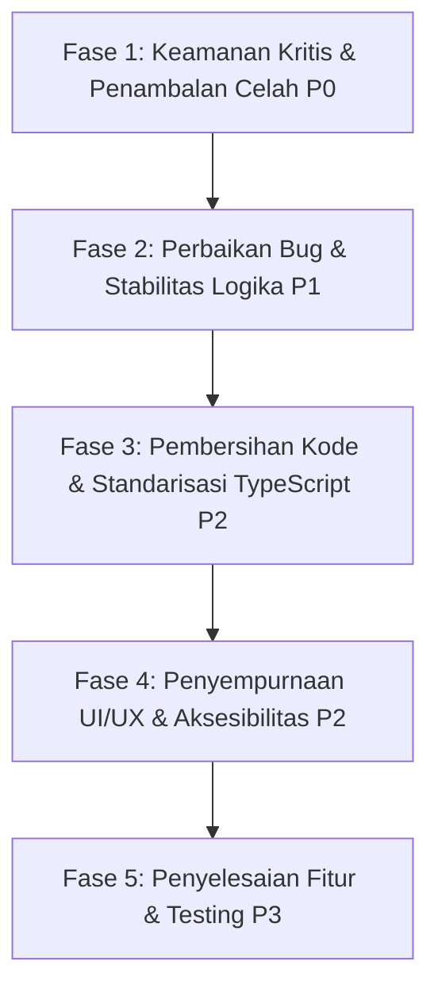

# 📋 Master Task Roadmap & Technical Implementation Guide
### Expedient Generation (Next.js 15 App Router + Supabase)

> Dokumen ini dirancang sebagai panduan instruksi kerja teknis bagi AI Agent atau Developer untuk mengeksekusi perbaikan bug, penambalan celah keamanan, optimasi arsitektur, dan pengembangan fitur secara berurutan, terstruktur, dan presisi.

---

## 🧭 Ikhtisar Urutan Fase Eksekusi



---

## 🔴 FASE 1: Keamanan Kritis & Penambalan Celah (Priority: P0 - Critical)

Tujuan: Menutup semua lubang keamanan eksploitatif sebelum aplikasi diakses pengguna secara luas.

---

### Task 1.1: Penambalan Celah Upload API (Auth, Path Traversal, MIME Type & Size Validation)
- **ID Task:** `SEC-01`
- **File Target:** [`src/app/api/upload/route.ts`](file:///c:/Users/LENOVO/angkatan1/expedient-next/src/app/api/upload/route.ts)
- **Kategori:** Security / Vulnerability Fix

#### Deskripsi Masalah:
1. Endpoint `POST /api/upload` dapat diakses oleh publik tanpa verifikasi sesi pengguna (`auth.getUser()`).
2. Parameter `folder` diterima langsung dari form data tanpa validasi (rentan Path Traversal seperti `../../etc`).
3. Tidak ada validasi tipe file (MIME) atau ekstensi, memungkinkan pengunggahan file berbahaya (`.exe`, `.html`, `.svg` berkode XSS).
4. Tidak ada batasan ukuran file maksimum.

#### Langkah Implementasi:
1. Panggil `const supabase = await createClient();` dan cek sesi `const { data: { user } } = await supabase.auth.getUser();`. Kembalikan respons 401 jika `!user`.
2. Buat whitelist folder yang diizinkan (contoh: `const ALLOWED_FOLDERS = ['gallery', 'profiles', 'chat'];`). Jika folder di luar whitelist, tolak dengan status 400.
3. Batasi MIME type hanya untuk gambar aman: `image/jpeg`, `image/png`, `image/webp`, `image/gif`.
4. Batasi ukuran file maksimum (contoh: 5 MB).
5. Sanitasi nama file dan gunakan format nama unik yang aman: `${user.id}_${Date.now()}_${random}.${ext}`.

#### Acceptance Criteria:
- [ ] Permintaan tanpa cookie login mengembalikan status HTTP 401 Unauthorized.
- [ ] Folder selain whitelist (misal `../bad_folder`) ditolak dengan HTTP 400.
- [ ] File dengan tipe non-gambar (misal `.exe` atau script) ditolak dengan HTTP 400.
- [ ] File lebih dari 5 MB ditolak dengan HTTP 413 / 400.

---

### Task 1.2: Pembersihan Hardcoded Secrets & Token Expositions
- **ID Task:** `SEC-02`
- **File Target:**
  - [`vercel.json`](file:///c:/Users/LENOVO/angkatan1/expedient-next/vercel.json)
  - [`src/app/api/cron/run/route.ts`](file:///c:/Users/LENOVO/angkatan1/expedient-next/src/app/api/cron/run/route.ts)
  - [`src/app/api/admin/unlock/route.ts`](file:///c:/Users/LENOVO/angkatan1/expedient-next/src/app/api/admin/unlock/route.ts)
- **Kategori:** Security / Secret Management

#### Deskripsi Masalah:
1. `vercel.json` menyertakan token rahasia cron `expedient_cron_secret_2026` dalam plain-text di repository Git.
2. `src/app/api/cron/run/route.ts` memiliki fallback hardcode token `token !== 'expedient_cron_secret_2026'`.
3. `src/app/api/admin/unlock/route.ts` memiliki fallback password default `"expedient2026"`.

#### Langkah Implementasi:
1. Pada `src/app/api/cron/run/route.ts`, verifikasi header `Authorization: Bearer <CRON_SECRET>` atau query token yang **hanya** dicocokkan dengan `process.env.CRON_SECRET`. Hapus semua nilai string literal hardcode.
2. Pada `src/app/api/admin/unlock/route.ts`, pastikan jika `process.env.ADMIN_MASTER_PASSWORD` tidak terdefinisi, server mengembalikan error 500 (bukan menggunakan password default lemah).
3. Pada `vercel.json`, atur path cron menjadi standar `/api/cron/run` dan gunakan Vercel Cron Secret headers bawaan platform.

#### Acceptance Criteria:
- [ ] Tidak ada string rahasia/token default di file `.ts` atau `.json`.
- [ ] Endpoint cron menolak eksekusi jika `process.env.CRON_SECRET` salah/hilang.
- [ ] Endpoint unlock menolak otentikasi jika environment variable password tidak di-set.

---

### Task 1.3: Pengamanan Endpoint AI Oracle & Endpoint Sensitif
- **ID Task:** `SEC-03`
- **File Target:** [`src/app/api/oracle/route.ts`](file:///c:/Users/LENOVO/angkatan1/expedient-next/src/app/api/oracle/route.ts)
- **Kategori:** Security / Abuse Prevention

#### Deskripsi Masalah:
Endpoint `/api/oracle` memanggil Gemini API tanpa proteksi autentikasi yang kuat dan tanpa rate-limiting, sehingga rentan disalahgunakan (spam/DDoS) yang dapat menguras kuota API pengguna.

#### Langkah Implementasi:
1. Tambahkan pengecekan autentikasi Supabase `auth.getUser()`.
2. Integrasikan rate limiter (`lib/rate-limit.ts`) berdasarkan `user.id` atau Client IP untuk membatasi pemanggilan (misal: maks 5 permintaan per 10 menit per user).
3. Validasi skema dan sanitasi panjang payload input (misal `name`, `vision`, `motivation` dibatasi maksimal 500 karakter).

#### Acceptance Criteria:
- [ ] Permintaan tanpa login ditolak HTTP 401.
- [ ] Permintaan beruntun melebihi batas mengembalikan HTTP 429 Too Many Requests.

---

### Task 1.4: Peningkatan Sanitasi HTML & Penerapan Content Security Policy (CSP)
- **ID Task:** `SEC-04`
- **File Target:**
  - [`src/lib/sanitize.ts`](file:///c:/Users/LENOVO/angkatan1/expedient-next/src/lib/sanitize.ts)
  - [`next.config.ts`](file:///c:/Users/LENOVO/angkatan1/expedient-next/next.config.ts)
- **Kategori:** Security / XSS Prevention

#### Deskripsi Masalah:
1. `sanitize.ts` saat ini menggunakan regex manual sederhana yang rentan terhadap bypass nested-tag XSS.
2. `next.config.ts` belum menetapkan header `Content-Security-Policy`.

#### Langkah Implementasi:
1. Gunakan library sanitasi yang telah teruji (seperti `isomorphic-dompurify` atau parser AST HTML yang ketat) atau perkuat sanitasi server-side tanpa regex rekursif yang mudah dibypass.
2. Tambahkan header `Content-Security-Policy` di dalam blok `headers()` pada `next.config.ts` dengan policy yang mengizinkan font Google, CDN FontAwesome, Agora RTC, dan Supabase storage domain.

#### Acceptance Criteria:
- [ ] Payload XSS seperti `` dan nested script berhasil dinetralkan.
- [ ] Header respons menyertakan CSP yang valid tanpa merusak tampilan eksternal yang diizinkan.

---

## 🟡 FASE 2: Perbaikan Bug & Stabilitas Logika (Priority: P1 - High)

Tujuan: Memperbaiki kesalahan logika runtime, performa real-time, dan inkonsistensi data.

---

### Task 2.1: Perbaikan Resolusi URL Avatar pada Chat Inbox
- **ID Task:** `BUG-01`
- **File Target:** [`src/app/(dashboard)/chat/page.tsx`](file:///c:/Users/LENOVO/angkatan1/expedient-next/src/app/(dashboard)/chat/page.tsx)
- **Kategori:** Bug Fix / Media URL

#### Deskripsi Masalah:
Kode pada baris 91-93 mengasumsikan `foto_profil` selalu berupa nama file lokal (`/uploads/profiles/${item.contact.foto_profil}`). Padahal, sistem registrasi/profil menyimpan URL absolut dari Supabase Storage (`https://...`). Hal ini menyebabkan URL rusak: `/uploads/profiles/https://...` (HTTP 404).

#### Langkah Implementasi:
1. Buat helper function untuk resolve avatar URL:
   ```typescript
   function getAvatarUrl(fotoProfil: string | null | undefined, nama: string) {
     if (!fotoProfil) {
       return `https://ui-avatars.com/api/?name=${encodeURIComponent(nama)}&background=d4af37&color=000`;
     }
     if (fotoProfil.startsWith('http://') || fotoProfil.startsWith('https://')) {
       return fotoProfil;
     }
     return `/uploads/profiles/${fotoProfil}`;
   }
   ```
2. Terapkan fungsi ini pada perenderan list chat inbox.

#### Acceptance Criteria:
- [ ] Foto profil alumni yang berasal dari Supabase Storage maupun lokal tampil normal tanpa broken image.

---

### Task 2.2: Optimasi Supabase Client & Pencegahan Infinite Re-subscribe pada Navbar
- **ID Task:** `BUG-02`
- **File Target:** [`src/components/layout/Navbar.tsx`](file:///c:/Users/LENOVO/angkatan1/expedient-next/src/components/layout/Navbar.tsx)
- **Kategori:** Performance / Memory Leak Fix

#### Deskripsi Masalah:
`const supabase = createClient();` dipanggil langsung di badan komponen tanpa `useMemo`. Di saat yang sama, `supabase` dimasukkan ke dalam dependency array `useEffect` (L107), menyebabkan pembentukan channel realtime baru dan listener berulang pada setiap re-render.

#### Langkah Implementasi:
1. Inisialisasi Supabase client di luar komponen (singleton) atau gunakan `useMemo(() => createClient(), [])`.
2. Pastikan `useEffect` hanya me-re-subscribe jika diperlukan dan membersihkan channel (`supabase.removeChannel(channel)`) secara sempurna saat unmount.

#### Acceptance Criteria:
- [ ] Channel realtime tidak diduplikasi di Supabase Dashboard / Network tab saat user berinteraksi dengan Navbar.

---

### Task 2.3: Gamifikasi Atomik via Database RPC (Mencegah Race Condition)
- **ID Task:** `BUG-03`
- **File Target:**
  - `supabase/migrations/20260831000000_atomic_prestise_rpc.sql` (Migrasi baru)
  - [`src/lib/gamification.ts`](file:///c:/Users/LENOVO/angkatan1/expedient-next/src/lib/gamification.ts)
- **Kategori:** Database / Concurrency Fix

#### Deskripsi Masalah:
Fungsi `addPrestise` membaca poin user saat ini (`SELECT prestise_points`), lalu melakukan `UPDATE` dengan nilai baru. Jika dua aktivitas terjadi bersamaan, update poin dapat tertimpa (lost update anomaly).

#### Langkah Implementasi:
1. Buat SQL Function/RPC di PostgreSQL:
   ```sql
   CREATE OR REPLACE FUNCTION increment_prestise(target_user_id UUID, pts INT)
   RETURNS VOID AS $$
   BEGIN
     UPDATE public.profiles
     SET prestise_points = COALESCE(prestise_points, 0) + pts
     WHERE id = target_user_id;
   END;
   $$ LANGUAGE plpgsql SECURITY DEFINER;
   ```
2. Ganti operasi update manual di `src/lib/gamification.ts` dengan memanggil `.rpc('increment_prestise', { target_user_id: userId, pts: points })`.

#### Acceptance Criteria:
- [ ] Penambahan poin terjadi secara atomik tanpa risiko kehilangan data akibat konkurensi.

---

### Task 2.4: Sinkronisasi Logika Filter Ulang Tahun (Beranda vs Cron)
- **ID Task:** `BUG-04`
- **File Target:**
  - [`src/app/(dashboard)/beranda/page.tsx`](file:///c:/Users/LENOVO/angkatan1/expedient-next/src/app/(dashboard)/beranda/page.tsx)
  - [`src/app/api/cron/run/route.ts`](file:///c:/Users/LENOVO/angkatan1/expedient-next/src/app/api/cron/run/route.ts)
- **Kategori:** Bug Fix / Logic Consistency

#### Deskripsi Masalah:
Beranda mem-parsing tanggal dengan membagi string berdasarkan dash `YYYY-MM-DD`, sedangkan Cron menggunakan `endsWith(-MM-DD)`. Format yang tidak konsisten dapat memicu perbedaan data yang tampil di UI dengan notifikasi WhatsApp yang terkirim.

#### Langkah Implementasi:
1. Buat utilitas bersama (shared helper) untuk mengecek apakah suatu tanggal lahir jatuh pada hari ini:
   ```typescript
   export function isBirthdayToday(dateString: string | null | undefined): boolean {
     if (!dateString) return false;
     const [year, month, day] = dateString.split('-').map(Number);
     const now = new Date();
     return month === (now.getMonth() + 1) && day === now.getDate();
   }
   ```
2. Gunakan helper ini di kedua file tersebut.

#### Acceptance Criteria:
- [ ] User yang muncul di widget "Ulang Tahun Hari Ini" di beranda 100% sama dengan user yang menerima ucapan via cron runner.

---

### Task 2.5: Menghilangkan Duplikasi Visual Layer (Film Grain, Aurora, Particles)
- **ID Task:** `BUG-05`
- **File Target:**
  - [`src/app/layout.tsx`](file:///c:/Users/LENOVO/angkatan1/expedient-next/src/app/layout.tsx)
  - [`src/app/page.tsx`](file:///c:/Users/LENOVO/angkatan1/expedient-next/src/app/page.tsx)
- **Kategori:** Performance / UI Bug Fix

#### Deskripsi Masalah:
Elemen `.film-grain`, `.aurora-container`, dan `<canvas id="particles-js">` didefinisikan di `RootLayout` (`src/app/layout.tsx`), namun diulangi lagi di dalam `LandingPage` (`src/app/page.tsx`). Hal ini menyebabkan beban GPU/Canvas ganda pada landing page.

#### Langkah Implementasi:
1. Hapus tag `.film-grain`, `.aurora-container`, dan `<ParticleBackground />` duplikat dari `src/app/page.tsx`, biarkan `RootLayout` dan `ClientLayout` yang mengelolanya secara global.

#### Acceptance Criteria:
- [ ] Di browser DOM hanya terdapat 1 instance `.film-grain`, 1 instance `.aurora-container`, dan 1 instance canvas partikel.

---

## 🧹 FASE 3: Pembersihan Kode & Standarisasi TypeScript (Priority: P2 - Medium)

Tujuan: Merapikan struktur direktori, mengaktifkan type checking penuh, dan menghapus kode sampah.

---

### Task 3.1: Pembersihan File Sampah & Temporary di Root
- **ID Task:** `CLN-01`
- **File Target:** Root workspace `expedient-next/`
- **Kategori:** Code Hygiene

#### Langkah Implementasi:
1. Hapus file-file temporary hasil pengujian sebelumnya:
   - `agent_code.txt`, `agent_code_full.txt`, `beranda_changes.txt`, `diff.txt`, `gallery_search.txt`, `step680.txt`, `step688.json`, `temp_css.txt`, `temp_radar_css.txt`, `test2.js`, `test_rls.js`, `tools_called.txt`, `transcript_search.txt`, `check_radar.js`, `check_syndicate_schema.js`, `extract_steps.js`, `fix_layout.js`, `fix_overlap.js`, `fix_trigger.js`.
2. Pindahkan script migrasi/seeding yang masih terpakai ke direktori `scripts/`:
   - `seed_cms.js`, `run_migration.js`, `generate_vapid.js`, `cms-seed.json`, `cms-seed-remaining.json`.
3. Pindahkan file dump SQL lama ke direktori `backup/` atau masukkan ke `.gitignore`.

#### Acceptance Criteria:
- [ ] Direktori root bersih dari file `.txt` dan skrip debugging ad-hoc.

---

### Task 3.2: Refaktorisasi Manipulasi DOM pada Login Biometrik
- **ID Task:** `CLN-02`
- **File Target:** [`src/app/login/page.tsx`](file:///c:/Users/LENOVO/angkatan1/expedient-next/src/app/login/page.tsx)
- **Kategori:** React Best Practices

#### Deskripsi Masalah:
`handleLoginBiometric` menggunakan `document.getElementById("email")` dan manipulasi `innerHTML` tombol secara manual (`document.querySelector(".btn-bio")`).

#### Langkah Implementasi:
1. Buat state React untuk `email` (`const [email, setEmail] = useState('')`) dan state loading biometrik (`const [bioLoading, setBioLoading] = useState(false)`).
2. Ikat input email dengan `value` & `onChange`.
3. Render konten tombol biometrik secara kondisional berdasarkan state `bioLoading`.

#### Acceptance Criteria:
- [ ] Tidak ada pemanggilan `document.getElementById` atau manipulasi DOM langsung di dalam fungsi autentikasi biometrik.

---

### Task 3.3: Refaktorisasi Inline Styles Dropdown Chat pada Navbar
- **ID Task:** `CLN-03`
- **File Target:**
  - [`src/components/layout/Navbar.tsx`](file:///c:/Users/LENOVO/angkatan1/expedient-next/src/components/layout/Navbar.tsx)
  - `src/app/(dashboard)/chat/chat.css`
- **Kategori:** Code Cleanliness / CSS Refactoring

#### Langkah Implementasi:
1. Pindahkan lebih dari 30 baris inline style pada elemen chat dropdown ke class-class CSS terstruktur di `chat.css` (misal `.lounge-dropdown-header`, `.lounge-dropdown-body`, `.lounge-dropdown-form`).
2. Terapkan variabel tema `--glass-bg`, `--glass-border`, `--gold-main` secara konsisten.

#### Acceptance Criteria:
- [ ] Komponen Navbar bebas dari inline style kompleks.

---

### Task 3.4: Pengaktifan Type Checking & Strict Build
- **ID Task:** `CLN-04`
- **File Target:** [`next.config.ts`](file:///c:/Users/LENOVO/angkatan1/expedient-next/next.config.ts)
- **Kategori:** TypeScript / CI Reliability

#### Langkah Implementasi:
1. Ubah konfigurasi `next.config.ts`:
   ```typescript
   eslint: { ignoreDuringBuilds: false },
   typescript: { ignoreBuildErrors: false },
   ```
2. Jalankan perintah `npm run build` dan perbaiki semua type error atau linting error yang ditemukan sampai build berhasil 100%.

#### Acceptance Criteria:
- [ ] Perintah `npm run build` berhasil dieksekusi tanpa mengabaikan error TypeScript atau ESLint.

---

## 🎨 FASE 4: Penyempurnaan UI/UX & Aksesibilitas (Priority: P2 - Medium)

Tujuan: Memenuhi standar interaksi manusia-komputer (Hukum UI/UX) dan standar aksesibilitas WCAG.

---

### Task 4.1: Implementasi Fungsionalitas Penuh Command Palette (Ctrl+K)
- **ID Task:** `UIUX-01`
- **File Target:**
  - [`src/app/(dashboard)/layout.tsx`](file:///c:/Users/LENOVO/angkatan1/expedient-next/src/app/(dashboard)/layout.tsx)
  - [`src/components/layout/CommandPalette.tsx`](file:///c:/Users/LENOVO/angkatan1/expedient-next/src/components/layout/CommandPalette.tsx)
- **Kategori:** UI/UX / Feature Polish

#### Deskripsi Masalah:
Dashboard layout memuat placeholder HTML static `#cmdPalette` yang disembunyikan dengan `display: none`, tanpa event listener keyboard global. Komponen `CommandPalette.tsx` yang sudah ada belum diintegrasikan dengan baik.

#### Langkah Implementasi:
1. Hapus blok static HTML placeholder di `src/app/(dashboard)/layout.tsx`.
2. Pasang komponen `<CommandPalette />` aktif di `DashboardLayout`.
3. Pastikan shortcut `Ctrl+K` atau `Cmd+K` membuka modal pencarian rute, pencarian alumni, dan navigasi cepat dengan keyboard (panah atas/bawah, enter, ESC).

#### Acceptance Criteria:
- [ ] Menekan `Ctrl+K` di halaman dashboard manapun membuka Command Palette.
- [ ] Pengguna dapat mencari halaman/alumni dan menavigasi tanpa mouse.
- [ ] Menekan `ESC` menutup Command Palette dengan mulus.

---

### Task 4.2: Standarisasi Touch Target & Ergonomi Mobile (Hukum Fitts)
- **ID Task:** `UIUX-02`
- **File Target:**
  - [`src/components/layout/Sidebar.tsx`](file:///c:/Users/LENOVO/angkatan1/expedient-next/src/components/layout/Sidebar.tsx)
  - [`public/css/template.css`](file:///c:/Users/LENOVO/angkatan1/expedient-next/public/css/template.css)
- **Kategori:** UI/UX / Mobile Ergonomics

#### Langkah Implementasi:
1. Pastikan touch target semua tombol navigasi dan action bar minimal berukuran 48x48px pada perangkat layar sentuh (`@media (pointer: coarse)`).
2. Berikan padding yang memadai pada tombol toggle sidebar dan bottom navigation untuk mencegah mis-click.

#### Acceptance Criteria:
- [ ] Semua elemen interaktif pada mode mobile memiliki bounding box minimal 48x48px.

---

### Task 4.3: Perataan dan Manajemen Z-Index Floating Widgets (Navbar)
- **ID Task:** `UIUX-03`
- **File Target:** [`src/components/layout/Navbar.tsx`](file:///c:/Users/LENOVO/angkatan1/expedient-next/src/components/layout/Navbar.tsx)
- **Kategori:** UI/UX / Layout Fix

#### Deskripsi Masalah:
Widget Chat, Theme Toggle, Notification Bell, dan Incoming Call Receiver menggunakan floating position independen yang berisiko bertumpuk (overlap) pada layar mobile atau tablet.

#### Langkah Implementasi:
1. Bungkus seluruh floating widget di Navbar ke dalam sebuah container bersama (misal: `<div className="floating-widgets-dock">`).
2. Gunakan layout flexbox/grid vertikal atau horizontal teratur dengan jarak `gap: 10px` dan `z-index` yang tertata rapi.

#### Acceptance Criteria:
- [ ] Tidak ada widget mengambang yang saling menutupi pada breakpoint layar apa pun (320px s/d 4K).

---

## 🚀 FASE 5: Penyelesaian Fitur & Ekspansi Masa Depan (Priority: P3 - Enhancement)

Tujuan: Melengkapi fitur-fitur yang masih bersifat simulasi/placeholder dan menyiapkan sistem untuk skala besar.

---

### Task 5.1: Integrasi Email Queue Dispatcher Riil (Resend / SendGrid)
- **ID Task:** `FEAT-01`
- **File Target:**
  - [`src/lib/email.ts`](file:///c:/Users/LENOVO/angkatan1/expedient-next/src/lib/email.ts)
  - [`src/app/api/cron/run/route.ts`](file:///c:/Users/LENOVO/angkatan1/expedient-next/src/app/api/cron/run/route.ts)
- **Kategori:** Feature Integration / Email

#### Langkah Implementasi:
1. Implementasikan pengiriman email menggunakan provider seperti Resend API atau SMTP di `src/lib/email.ts`.
2. Update worker antrian email di `src/app/api/cron/run/route.ts` untuk memproses antrian email yang berstatus `pending` menjadi `sent` atau `failed` dengan pesan error riil.

---

### Task 5.2: Pembuatan Automated Test Suite (Unit & E2E Testing)
- **ID Task:** `FEAT-02`
- **File Target:** Direktori `tests/` atau `__tests__/`
- **Kategori:** Testing / QA

#### Langkah Implementasi:
1. Setup Vitest untuk pengujian fungsi utilitas (`gamification.test.ts`, `sanitize.test.ts`, `rate-limit.test.ts`).
2. Setup Playwright untuk E2E testing pada alur kritis:
   - Login flow & Session validation.
   - Mengisi Buku Tamu & penambahan poin prestise.
   - Pengiriman pesan di Lounge chat.

---

## 📊 Matriks Ringkasan Task untuk AI Agent

| ID Task | Judul Task | Prioritas | Estimasi Kompleksitas | Dependensi |
|---|---|---|---|---|
| **SEC-01** | Pengamanan Upload API (Auth, Traversal, MIME) | 🔴 P0 - Critical | Sedang | - |
| **SEC-02** | Hapus Hardcoded Secrets (Cron, Admin, Vercel) | 🔴 P0 - Critical | Rendah | - |
| **SEC-03** | Auth & Rate Limiter pada Oracle AI | 🔴 P0 - Critical | Rendah | - |
| **SEC-04** | Peningkatan Sanitizer & Header CSP | 🔴 P0 - Critical | Sedang | - |
| **BUG-01** | Fix Resolusi URL Avatar Chat Inbox | 🟡 P1 - High | Rendah | - |
| **BUG-02** | Fix Supabase Re-render Leak di Navbar | 🟡 P1 - High | Rendah | - |
| **BUG-03** | Gamifikasi Atomik via Postgres RPC | 🟡 P1 - High | Sedang | - |
| **BUG-04** | Sinkronisasi Helper Filter Ulang Tahun | 🟡 P1 - High | Rendah | - |
| **BUG-05** | Hapus Layer Visual Duplikat (Landing/Layout) | 🟡 P1 - High | Rendah | - |
| **CLN-01** | Bersihkan File Sampah/Debug di Root | 🟢 P2 - Medium | Rendah | - |
| **CLN-02** | Refaktor DOM Manipulation di Login Page | 🟢 P2 - Medium | Rendah | - |
| **CLN-03** | Refaktor Inline Styles Dropdown Navbar | 🟢 P2 - Medium | Rendah | - |
| **CLN-04** | Aktifkan Strict TypeScript & ESLint Build | 🟢 P2 - Medium | Tinggi | CLN-02, CLN-03 |
| **UIUX-01** | Integrasi Fungsional Command Palette (Ctrl+K) | 🟢 P2 - Medium | Sedang | - |
| **UIUX-02** | Standarisasi Touch Target Mobile (Fitts) | 🟢 P2 - Medium | Rendah | - |
| **UIUX-03** | Docking & Layout Floating Widgets Navbar | 🟢 P2 - Medium | Rendah | - |
| **FEAT-01** | Implementasi Dispatcher Email Antrian Riil | ⚪ P3 - Future | Sedang | SEC-02 |
| **FEAT-02** | Automated Testing (Vitest & Playwright) | ⚪ P3 - Future | Tinggi | CLN-04 |

---

> [!TIP]
> **Petunjuk bagi AI Agent Penerus:**
> 1. Mulai eksekusi tepat dari **FASE 1 (SEC-01 s/d SEC-04)** untuk memastikan tidak ada celah keamanan yang terbuka.
> 2. Lanjutkan ke **FASE 2 (BUG-01 s/d BUG-05)** untuk menjaga integritas fungsi dan memori aplikasi.
> 3. Setelah Fase 1 & 2 selesai, jalankan pembersihan pada **FASE 3**, lalu verifikasi keberhasilan kompilasi dengan `npm run build`.
